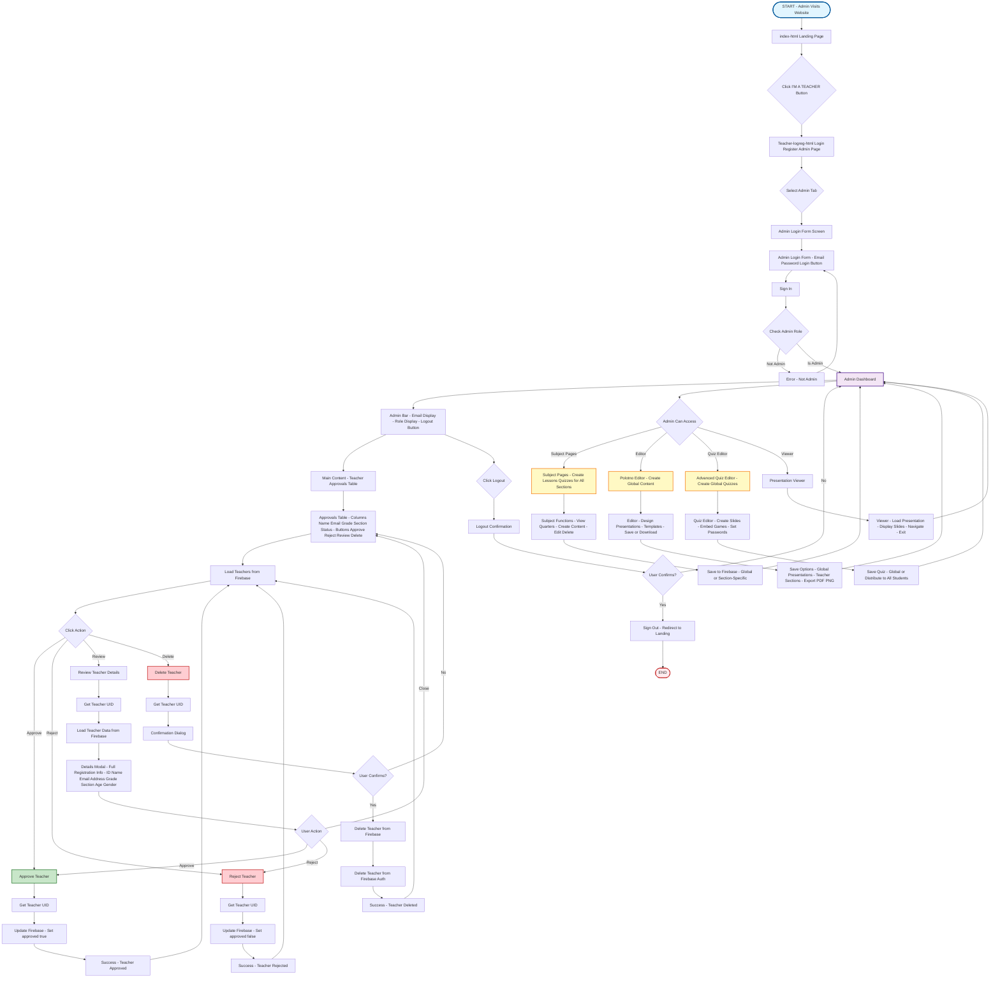

# Admin UI Flow Diagram
## Edutaktika Educational Platform

---

## Notes

### Admin Data Paths:
- `admins/uid` - Admin records
- `teachers/uid` - Teacher records (for approval management)

### Global Data Paths:
- `presentations/subject/quarter-q/title` - Global lessons
- `presentations/quizzes/subject/quarter/title` - Global quizzes

### Authentication:
- Firebase Auth for user authentication
- Admin role check required

