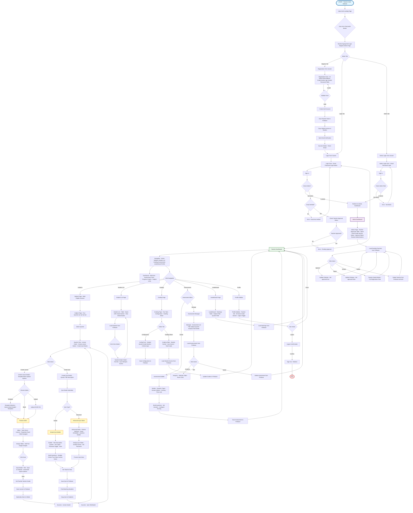
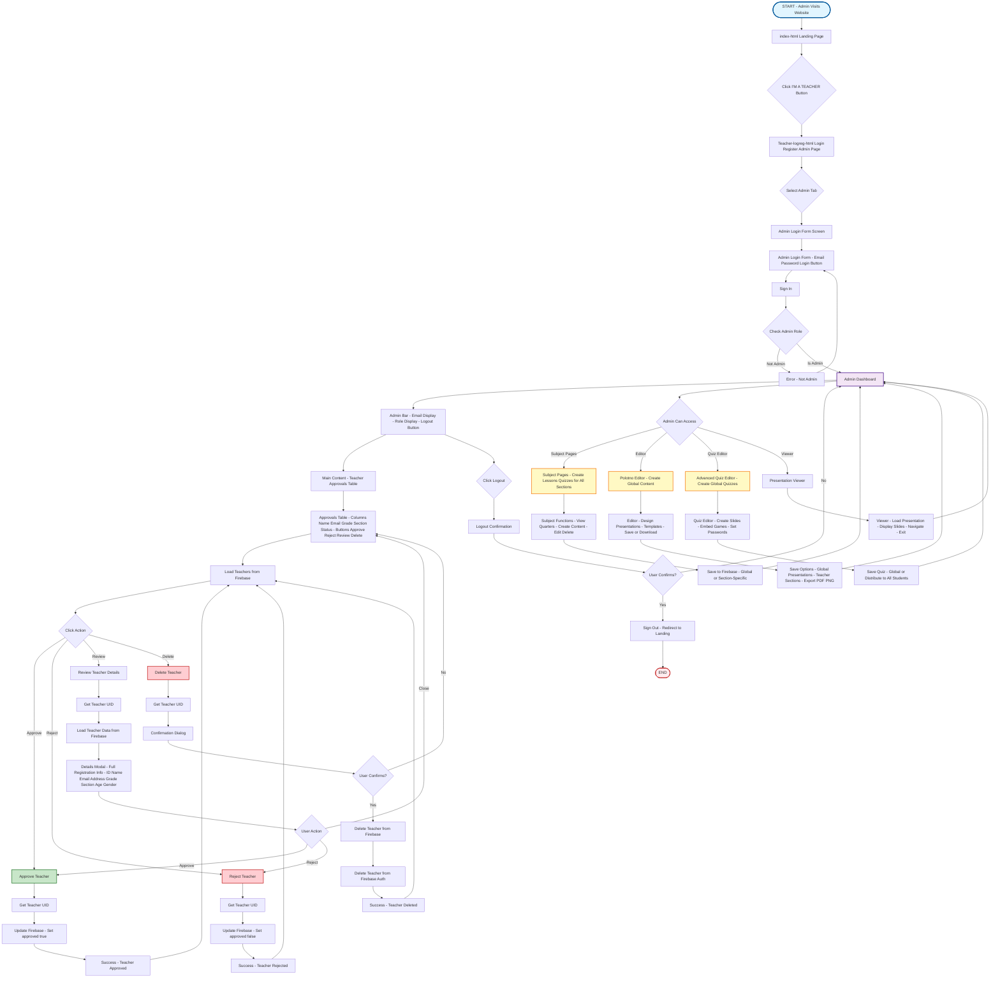

# System Flowcharts Index
## Edutaktika Educational Platform

This document provides an overview of all system flowcharts. Each role has been separated into its own file for easier navigation.

---

## Flowchart Files

### 📘 [Student Flowchart](STUDENT_FLOWCHART.md)
Complete UI flow diagram for students, including:
- Registration and login
- Dashboard navigation
- Viewing lessons and taking quizzes
- Leaderboard and quiz portal
- Profile management

### 👨‍🏫 [Teacher Flowchart](TEACHER_FLOWCHART.md)
Complete UI flow diagram for teachers, including:
- Registration and approval process
- Dashboard navigation
- Creating lessons and quizzes
- Student management and grading
- Assessment builder
- Leaderboard

### 👑 [Admin Flowchart](ADMIN_FLOWCHART.md)
Complete UI flow diagram for administrators, including:
- Admin login
- Teacher approval management
- Global content creation
- Access to all system features

---

## Combined View (Legacy)

Click to view all flowcharts in one document

## 1. STUDENT UI + DATA FLOW DIAGRAM

```mermaid
flowchart TD
    A([START - Student Visits Website]) --> B[index-html Landing Page]
    B --> C{Click I'M A STUDENT Button}
    C --> D[Student-logreg-html Login Register Page]
    D --> E{Select Tab}
    E -->|Register Tab| F[Registration Form Screen]
    E -->|Login Tab| G[Login Form Screen]
    
    F --> F1[Registration Form - LRN Name Email Address Grade Section Age Gender Password Fields]
    
    F1 --> F2{Validate Form}
    F2 -->|Invalid| F1
    F2 -->|Valid| F3[Create Auth Account]
    F3 --> F4[Save Student Data to Firebase]
    F4 --> F5[Send Email Verification]
    F5 --> F6[Auto-Assign Quizzes from Matching Teacher]
    F6 --> F7[Success Modal - Registration Successful]
    F7 --> G
    
    G --> G1[Form Fields - Email Password Login Button]
    G1 --> G2[Sign In]
    G2 --> G3{Email Verified?}
    G3 -->|No| G4[Error - Email Not Verified] --> G1
    G3 -->|Yes| G5[Check Student Record in Firebase]
    G5 --> G6{Student Record Exists?}
    G6 -->|No| G7[Error - No Student Record] --> G1
    G6 -->|Yes| H[Student Dashboard]
    
    H --> H1[Navigation Menu - Home Subjects Leaderboard Quiz Portal Profile]
    H1 --> H2[Dashboard - Welcome Section - Progress Graphs - Subject Links]
    
    H1 --> I{Click Navigation}
    I -->|Subjects| J[Subject Page - Math English Science]
    I -->|Leaderboard| K[Leaderboard Page]
    I -->|Quiz Portal| L[Quiz Portal Page]
    I -->|Profile| M[Profile Sidebar]
    
    J --> J1[Subject Page - Four Quarters Q1 Q2 Q3 Q4]
    J1 --> J2[Select Quarter]
    J2 --> J3[Quarter View - Lesson Cards - Quiz Cards with Status]
    
    J3 --> J4{Click Content}
    J4 -->|Lesson Card| N[Presentation Viewer]
    J4 -->|Quiz Card| O{Quiz Status?}
    
    N --> N1[Full-Screen Slides - Navigation Arrows - Slide Counter - Exit Button]
    N1 --> N2{User Action}
    N2 -->|Next Previous| N1
    N2 -->|Exit| J3
    
    O -->|Locked| P[Password Entry Modal]
    O -->|Unlocked| Q[Quiz Player Screen]
    O -->|Completed| R[View Results]
    
    P --> P1[Enter Password]
    P1 --> P2{Password Correct?}
    P2 -->|Wrong| P3[Error - Try Again] --> P1
    P2 -->|Correct| P4[Unlock Quiz in Firebase]
    P4 --> P5[Success - Quiz Unlocked]
    P5 --> Q
    
    Q --> Q1[Quiz Player - Questions - Answer Options - Progress Bar - Timer - Submit Button]
    Q1 --> Q2[Load Quiz from Firebase]
    Q2 --> Q3[Display Question]
    Q3 --> Q4{Continue?}
    Q4 -->|Next Previous| Q3
    Q4 -->|Submit| Q5[Calculate Score]
    
    Q5 --> Q6[Save Quiz Attempt to Firebase]
    Q6 --> Q7[Update Quiz Status to Completed]
    Q7 --> S[Results Screen - Score - Percentage - Correct Answers - Time Taken]
    
    S --> J3
    R --> J3
    
    K --> K1[Leaderboard - Rankings Table - Subject Filter - Your Position]
    K1 --> K2[Load Rankings from Firebase]
    K2 --> H
    
    L --> L1[Quiz Portal - All Quizzes List - Quarter Filter - Subject Filter]
    L1 --> L2[Load Quizzes from Firebase]
    L2 --> L3{Click Take Quiz}
    L3 --> O
    
    M --> M1[Profile Sidebar - Student Info - LRN Name Grade Section - Logout Toggle]
    M1 --> M2{User Action}
    M2 -->|Logout| M3[Logout Confirmation]
    M2 -->|Close| H
    M3 -->|Confirm| M4[Sign Out - Redirect to Landing]
    M4 --> AK([END])
    
    style A fill:#e1f5ff,stroke:#01579b,stroke-width:3px
    style H fill:#e3f2fd,stroke:#1565c0,stroke-width:2px
    style N fill:#fff9c4,stroke:#f57f17,stroke-width:2px
    style Q fill:#fff9c4,stroke:#f57f17,stroke-width:2px
    style S fill:#e0f2f1,stroke:#004d40,stroke-width:2px
    style AK fill:#ffebee,stroke:#c62828,stroke-width:2px
```

---

## 2. TEACHER UI + DATA FLOW DIAGRAM

---

## 3. ADMIN UI + DATA FLOW DIAGRAM

---

## Notes on Firebase Data Structure

### Student Data Paths:
- `students/uid` - Student profile
- `students/uid/quizzes/subject/quarter/title` - Student quiz assignments
- `students/uid/quizAttempts/quizId/timestamp` - Quiz attempt records
- `students/uid/assessments/assessmentId/attempts` - Assessment attempts

### Teacher Data Paths:
- `teachers/uid` - Teacher profile
- `teachers/uid/sections/section/lessons/subject/quarter-q/title` - Teacher lessons
- `teachers/uid/sections/section/quizzes/subject/quarter/title` - Teacher quizzes
- `teachers/uid/assessments/assessmentId` - Teacher assessments
- `teachers/uid/grades/subject/quarter/studentUID` - Student grades

### Global Data Paths:
- `presentations/subject/quarter-q/title` - Global lessons
- `admins/uid` - Admin records

### Authentication:
- Firebase Auth for user authentication
- Email verification required
- Teacher approval required via admin

---

## Quick Reference

### Student Data Paths:
- `students/uid` - Student profile
- `students/uid/quizzes/subject/quarter/title` - Student quiz assignments
- `students/uid/quizAttempts/quizId/timestamp` - Quiz attempt records
- `students/uid/assessments/assessmentId/attempts` - Assessment attempts

### Teacher Data Paths:
- `teachers/uid` - Teacher profile
- `teachers/uid/sections/section/lessons/subject/quarter-q/title` - Teacher lessons
- `teachers/uid/sections/section/quizzes/subject/quarter/title` - Teacher quizzes
- `teachers/uid/assessments/assessmentId` - Teacher assessments
- `teachers/uid/grades/subject/quarter/studentUID` - Student grades

### Global Data Paths:
- `presentations/subject/quarter-q/title` - Global lessons
- `admins/uid` - Admin records

### Authentication:
- Firebase Auth for user authentication
- Email verification required
- Teacher approval required via admin

