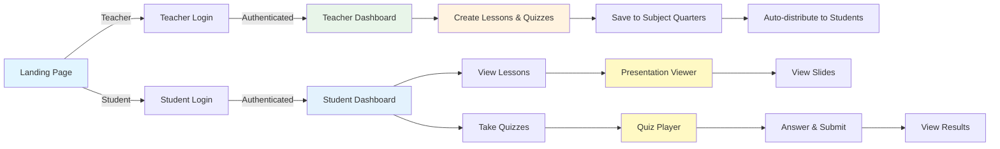
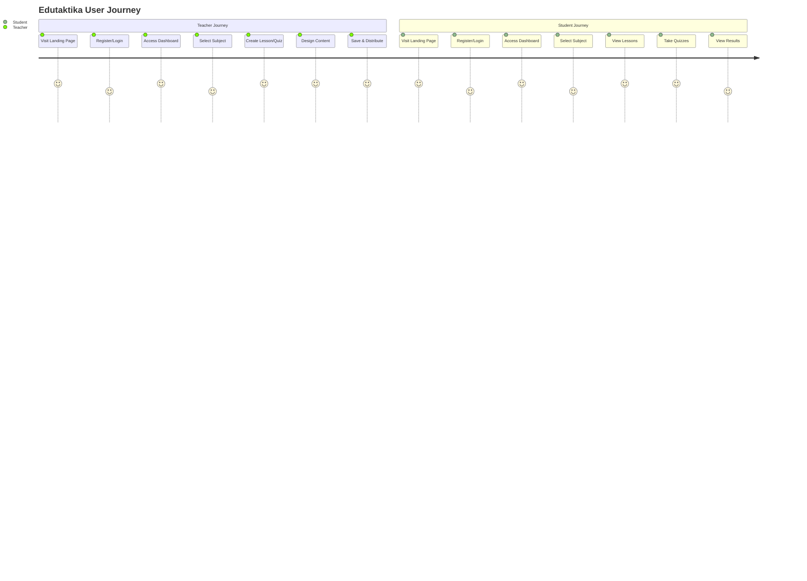

# Edutaktika UI Flow Diagram
## Visual Screen Flow - What Users See When Using the System

## Main UI Flowchart (Copy to mermaid.live)

This flowchart shows the actual UI screens and pages users see as they navigate through the system.

```mermaid
flowchart TD
    Start([index.html<br/>Landing Page<br/>Shows: Two Buttons<br/>I'M A TEACHER<br/>I'M A STUDENT]) --> RoleChoice{User Clicks Button}
    
    %% Teacher UI Flow
    RoleChoice -->|I'M A TEACHER| TeacherLogReg[Teacher/logreg.html<br/>Login/Register Page<br/>Shows: Three Tabs<br/>Login | Register | Admin<br/>Form Fields with Icons]
    
    TeacherLogReg --> TeacherTab{Which Tab Selected?}
    TeacherTab -->|Register Tab| TeacherRegScreen[Registration Form Screen<br/>Visible Fields:<br/>- ID Number input<br/>- First/Middle/Last Name<br/>- Email input<br/>- Address fields<br/>- Grade/Section dropdowns<br/>- Password fields<br/>- Submit button]
    
    TeacherTab -->|Login Tab| TeacherLoginScreen[Login Form Screen<br/>Shows:<br/>- Email input field<br/>- Password input field<br/>- Eye icon (show/hide)<br/>- Login button]
    
    TeacherRegScreen --> RegSuccessModal[Success Modal Popup<br/>Shows:<br/>Registration Successful!<br/>Check email message<br/>OK button]
    RegSuccessModal --> TeacherLoginScreen
    
    TeacherLoginScreen --> TeacherHome[Teacher/homepage.html<br/>Teacher Dashboard<br/>Shows:<br/>- Header with Nav Menu<br/>- Welcome Section<br/>- Assessment Tools Cards<br/>- Progress Graphs<br/>- Subject Quick Links]
    
    TeacherHome --> TeacherNav{Click Navigation Item}
    TeacherNav -->|Subjects| TeacherSubjectPage[Teacher/subject_math.html<br/>or subject_english.html<br/>or subject_science.html<br/>Shows:<br/>- Header Navigation<br/>- Four Quarter Sections<br/>- Each Quarter Shows:<br/>  • Lesson Cards Grid<br/>  • Create Lesson Button<br/>  • Create Quiz Button]
    
    TeacherNav -->|Leaderboard| TeacherLeaderboard[Teacher/leaderboard.html<br/>Shows:<br/>- Student Rankings Table<br/>- Subject Filter Dropdown<br/>- Score Columns]
    
    TeacherNav -->|Students| TeacherStudentList[Teacher/studentlist.html<br/>Shows:<br/>- Student Table<br/>- Filter Options<br/>- Student Details Modal]
    
    TeacherSubjectPage --> QuarterView[Quarter Section View<br/>Shows:<br/>- Lesson Cards (if any)<br/>- Empty State Message<br/>- Create Lesson Button<br/>- Create Quiz Button]
    
    QuarterView --> CreateLessonModal{Click Create Lesson}
    CreateLessonModal --> LessonModal[Create Lesson Modal<br/>Shows:<br/>- Use Template Option<br/>- Create Blank Option<br/>- Upload JSON Option<br/>- Cancel/Continue Buttons]
    
    LessonModal -->|Use Template| TemplateSelection[Template Selection Screen<br/>Shows:<br/>- Template Grid<br/>- Science/Math/English Cards<br/>- Preview Thumbnails]
    
    LessonModal -->|Create Blank| EditorScreen[Teacher/Editor.html<br/>Polotno Editor Screen<br/>Shows:<br/>- Left Sidebar: Tools Panel<br/>- Center: Canvas Area<br/>- Right: Properties Panel<br/>- Top: File Menu Bar<br/>- Bottom: Slide Navigator]
    
    TemplateSelection --> EditorScreen
    EditorScreen --> EditorToolbar[Editor Toolbar Visible<br/>Shows:<br/>- Text Tool Icon<br/>- Image Tool Icon<br/>- Shape Tools<br/>- Color Picker<br/>- Layer List]
    
    EditorToolbar --> EditorSave{Click Save}
    EditorSave --> SaveModal[Save Modal<br/>Shows:<br/>- Title Input Field<br/>- Save to Firebase Option<br/>- Download JSON Option<br/>- Export PDF/PNG Buttons]
    
    SaveModal -->|Save| BackToSubject[Return to Subject Page<br/>New Lesson Card Appears in Grid]
    BackToSubject --> QuarterView
    
    QuarterView --> CreateQuizModal{Click Create Quiz}
    CreateQuizModal --> QuizTypeModal[Quiz Type Selection Modal<br/>Shows:<br/>- Simple Quiz Builder Button<br/>- Advanced Quiz Editor Button]
    
    QuizTypeModal -->|Simple| SimpleQuizScreen[Teacher/create-quiz.html<br/>Simple Quiz Builder Screen<br/>Shows:<br/>- Title Input<br/>- Description Input<br/>- Quarter Selector<br/>- Test Type Selector<br/>- Add Test Button<br/>- Password Toggle<br/>- Save Button]
    
    QuizTypeModal -->|Advanced| AdvancedQuizScreen[Teacher/quizEditor.html<br/>Advanced Quiz Editor Screen<br/>Shows:<br/>- Polotno Editor Interface<br/>- Quiz Slide Designer<br/>- Game Embedder<br/>- Question Builder<br/>- Save/Publish Buttons]
    
    SimpleQuizScreen --> QuizSaved[Quiz Saved Confirmation<br/>Shows Success Message]
    AdvancedQuizScreen --> QuizSaved
    QuizSaved --> BackToSubject
    
    %% Student UI Flow
    RoleChoice -->|I'M A STUDENT| StudentLogReg[Student/logreg.html<br/>Login/Register Page<br/>Shows: Two Tabs<br/>Login | Register<br/>Form Fields with Icons]
    
    StudentLogReg --> StudentTab{Which Tab Selected?}
    StudentTab -->|Register Tab| StudentRegScreen[Registration Form Screen<br/>Shows:<br/>- LRN field (12 digits)<br/>- Name fields<br/>- Email field<br/>- Address fields<br/>- Grade/Section dropdowns<br/>- Password fields<br/>- Submit button]
    
    StudentTab -->|Login Tab| StudentLoginScreen[Login Form Screen<br/>Shows:<br/>- Email input<br/>- Password input<br/>- Login button]
    
    StudentRegScreen --> StudentRegSuccessModal[Success Modal Popup<br/>Shows:<br/>Registration Successful!<br/>Check email message<br/>OK button]
    StudentRegSuccessModal --> StudentLoginScreen
    
    StudentLoginScreen --> StudentHome[Student/homepage.html<br/>Student Dashboard<br/>Shows:<br/>- Header with Navigation<br/>- Welcome Section<br/>- Progress Summary Graphs<br/>- Subject Quick Links]
    
    StudentHome --> StudentNav{Click Navigation Item}
    StudentNav -->|Subjects| StudentSubjectPage[Student/subject_math.html<br/>or subject_english.html<br/>or subject_science.html<br/>Shows:<br/>- Header Navigation<br/>- Four Quarter Sections<br/>- Each Quarter Shows:<br/>  • Lesson Cards<br/>  • Quiz Cards<br/>  • Status Indicators]
    
    StudentNav -->|Leaderboard| StudentLeaderboard[Student/leaderboard.html<br/>Shows:<br/>- Rankings Table<br/>- Student Position<br/>- Scores Display]
    
    StudentSubjectPage --> StudentQuarterView[Quarter Section View<br/>Shows:<br/>- Lesson Cards (clickable)<br/>- Quiz Cards with Status:<br/>  🔒 Locked<br/>  ✅ Unlocked<br/>  ✓ Completed]
    
    StudentQuarterView --> StudentContentClick{Click Content Card}
    StudentContentClick -->|Click Lesson Card| PresentationScreen[Student/present.html<br/>Presentation Viewer Screen<br/>Shows:<br/>- Full-screen Slide Display<br/>- Navigation Arrows<br/>- Slide Counter (1/5)<br/>- Exit Button<br/>- Slide Transitions]
    
    PresentationScreen --> SlideNav{User Action}
    SlideNav -->|Next Arrow| PresentationScreen
    SlideNav -->|Previous Arrow| PresentationScreen
    SlideNav -->|Exit Button| StudentQuarterView
    
    StudentContentClick -->|Click Quiz Card| QuizCardClick[Quiz Card Clicked]
    QuizCardClick --> QuizStatusCheck{Quiz Status?}
    
    QuizStatusCheck -->|Locked| PasswordModal[Password Entry Modal<br/>Shows:<br/>- Password Input Field<br/>- Unlock Button<br/>- Cancel Button]
    
    QuizStatusCheck -->|Unlocked| QuizPlayerScreen[Student/quizView.html<br/>Quiz Player Screen<br/>Shows:<br/>- Quiz Title Header<br/>- Question Display<br/>- Answer Options<br/>- Progress Bar<br/>- Timer (if set)<br/>- Submit Button]
    
    QuizStatusCheck -->|Completed| ResultsScreen[Results Screen<br/>Shows:<br/>- Score Display<br/>- Correct/Incorrect Answers<br/>- Feedback Message]
    
    PasswordModal --> PasswordCheck{Password Correct?}
    PasswordCheck -->|Wrong| PasswordError[Error Message<br/>Shows:<br/>Incorrect Password<br/>Try Again]
    PasswordError --> PasswordModal
    PasswordCheck -->|Correct| UnlockSuccess[Unlock Success Message<br/>Quiz Now Available]
    UnlockSuccess --> QuizPlayerScreen
    
    QuizPlayerScreen --> AnsweringScreen[Answering Interface<br/>Shows:<br/>- Current Question<br/>- Multiple Choice Options<br/>- Or Interactive Game<br/>- Next/Previous Buttons]
    
    AnsweringScreen --> SubmitQuiz{Click Submit}
    SubmitQuiz --> LoadingScreen[Loading/Processing Screen<br/>Shows:<br/>- Calculating Score...<br/>- Spinner Animation]
    
    LoadingScreen --> QuizResultsScreen[Quiz Results Screen<br/>Shows:<br/>- Final Score<br/>- Percentage<br/>- Correct Answers Count<br/>- Time Taken<br/>- Review Answers Button]
    
    QuizResultsScreen --> BackToQuarter[Return to Subject Page<br/>Quiz Status Updated to Completed]
    BackToQuarter --> StudentQuarterView
    
    %% Styling
    classDef landing fill:#e1f5ff,stroke:#01579b,stroke-width:3px
    classDef auth fill:#fff3e0,stroke:#e65100,stroke-width:2px
    classDef dashboard fill:#e8f5e9,stroke:#2e7d32,stroke-width:2px
    classDef subject fill:#c8e6c9,stroke:#1b5e20,stroke-width:2px
    classDef editor fill:#fff9c4,stroke:#f57f17,stroke-width:2px
    classDef quiz fill:#e3f2fd,stroke:#1565c0,stroke-width:2px
    classDef modal fill:#f3e5f5,stroke:#4a148c,stroke-width:2px
    classDef results fill:#e0f2f1,stroke:#004d40,stroke-width:2px
    
    class Start,RoleChoice landing
    class TeacherLogReg,StudentLogReg,TeacherLoginScreen,StudentLoginScreen,TeacherRegScreen,StudentRegScreen auth
    class TeacherHome,StudentHome dashboard
    class TeacherSubjectPage,StudentSubjectPage,QuarterView,StudentQuarterView subject
    class EditorScreen,EditorToolbar,TemplateSelection editor
    class QuizPlayerScreen,AnsweringScreen quiz
    class PasswordModal,LessonModal,QuizTypeModal,SaveModal modal
    class QuizResultsScreen,ResultsScreen results
```

## Simplified High-Level Flow



## User Journey Flow



