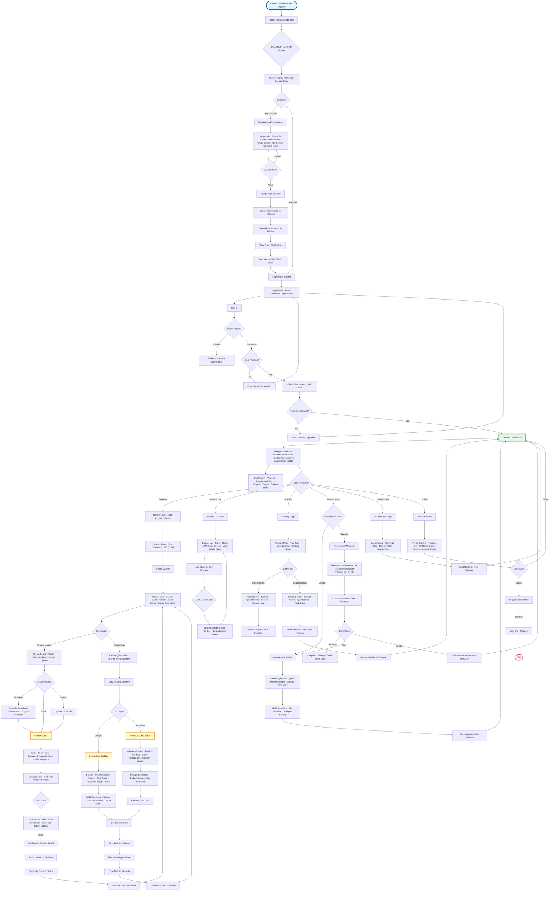

# Teacher UI Flow Diagram
## Edutaktika Educational Platform

---

## Notes

### Teacher Data Paths:
- `teachers/uid` - Teacher profile
- `teachers/uid/sections/section/lessons/subject/quarter-q/title` - Teacher lessons
- `teachers/uid/sections/section/quizzes/subject/quarter/title` - Teacher quizzes
- `teachers/uid/assessments/assessmentId` - Teacher assessments
- `teachers/uid/grades/subject/quarter/studentUID` - Student grades

### Global Data Paths:
- `presentations/subject/quarter-q/title` - Global lessons

### Authentication:
- Firebase Auth for user authentication
- Email verification required
- Teacher approval required via admin

